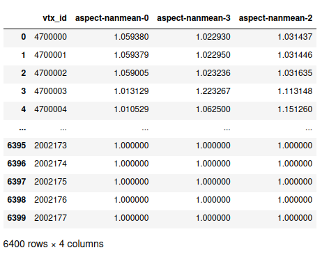
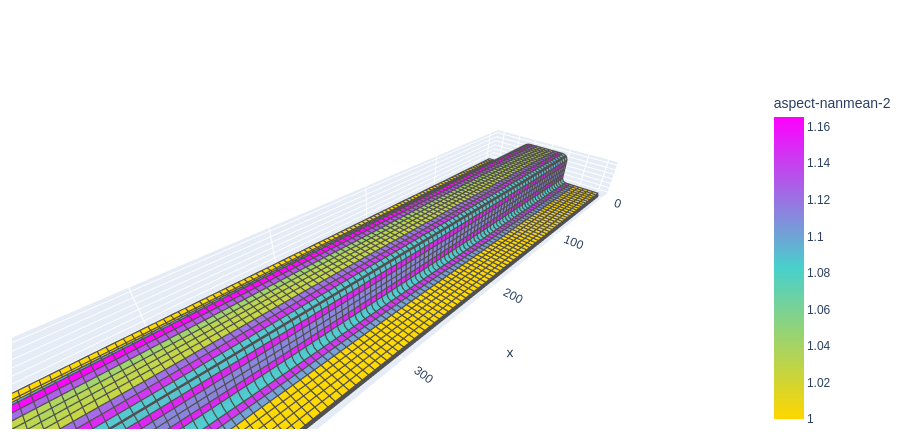

Mesh2Vec
========

Quickstart
-----------

<h1 align="center">mesh2vec</h1>
<p align="center">Turn CAE Mesh Data Into Element Feature Vectors</p>

<p align="center">
	<a href="https://github.com/renumics/mesh2vec"></a>    
 	<a href="https://github.com/renumics/mesh2vec"></a>   
 	<a href="https://github.com/renumics/mesh2vec"></a>   
</p>
<h3 align="center">
   <a href="https://renumics.github.io/mesh2vec/"><b>Latest Documentation</b></a>
</h3>

## 🚀 Introduction
Mesh2vec is a tool that facilitates the import of Computer-Aided Engineering (CAE) mesh data from [LS-DYNA](https://www.ansys.com/de-de/products/structures/ansys-ls-dyna).
It utilizes various quality metrics of elements and their surrounding neighborhood to aggregate feature vectors for each element. These feature vectors are of equal length and can be effectively utilized as inputs for machine learning methods. This represents a simpler and more efficient alternative to traditional mesh and graph-based approaches for automatic mesh quality analysis.

## ⏱️ Quickstart


### Installation
1. Create and activate a [virtual environment](https://packaging.python.org/en/latest/guides/installing-using-pip-and-virtual-environments/).
2. Use the following command to install mesh2vec into your environment:

```bash
pip install mesh2vec
```
3. Please make sure you have an environment variable ANSA_EXECUTABLE set pointing to your ANSA executable to use ANSA depended features like shell and feature import.
4. You may temporarily need to set an environment variable SKLEARN_ALLOW_DEPRECATED_SKLEARN_PACKAGE_INSTALL=True.

### Load Mesh
```python

from pathlib import Path
from mesh2vec.mesh2vec_cae import Mesh2VecCae
m2v = Mesh2VecCae.from_ansa_shell(4,
    Path("data/hat/Hatprofile.k"),
    json_mesh_file=Path("data/hat/cached_hat_key.json"))
```

### Add element features
```python
m2v.add_features_from_ansa(
    ["aspect", "warpage"],
    Path("data/hat/Hatprofile.k"),
    json_mesh_file=Path("data/hat/cached_hat_key.json"))
```

### Aggregate
```python
import numpy as np
m2v.aggregate("aspect", [0,2,3], np.nanmean)
```

### Extract Feature Vectors
```python
m2v.to_dataframe()
```


### Optional: Visualize a single aggregated feature on mesh
```python
m2v.get_visualization_plotly("aspect-nanmean-2")
```



